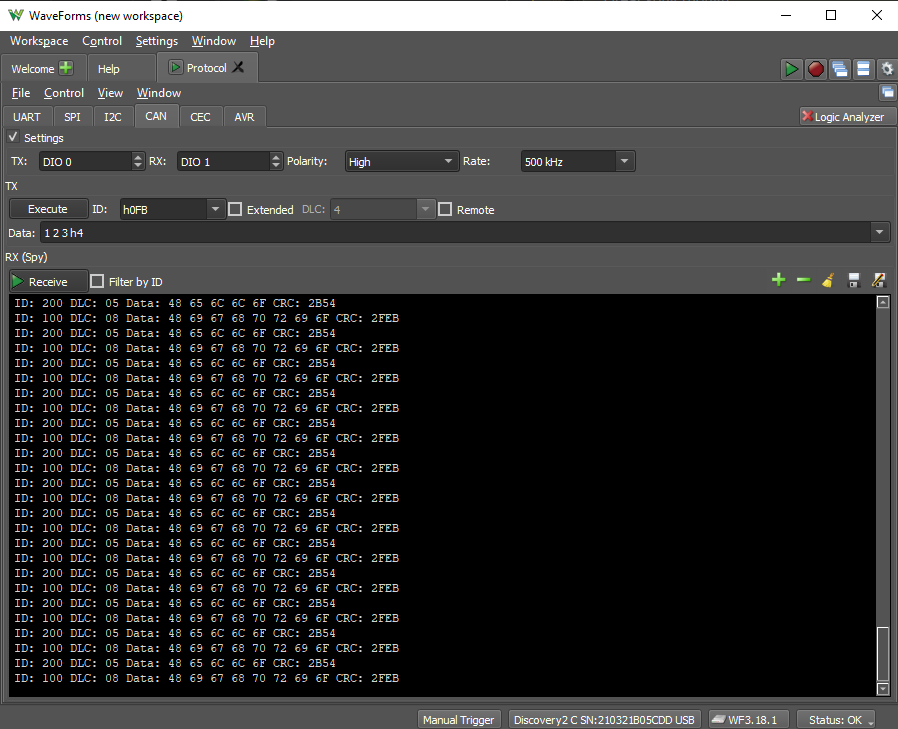

#Lab 08 for Semrah & Elmir

## One sending One Recieving
Here is an image showing one pico sending data on the CAN line and another reciving it:

## Delay Between Sending Different Priority
Here is an image showing one pico sending a high priority signal and another sending a lower priority signal. They have a delay so they both have time to transmit.

## No Delay Between Sending Different Priority
Here is an image showing no delay with different priorities. The speed at which they are sending is fast enough that we don't have time to acknowledge the messages. We can see though that the lower priority message is not appearing on the CAN bus.

[NoDelayTwoSend](images/NoDelayBetweenDifferentPriority.png)

## Assembly
Image showing the wiring with a analog discovery 2 as the oscilliscope.

[Assembly](images/RatsNest.png)